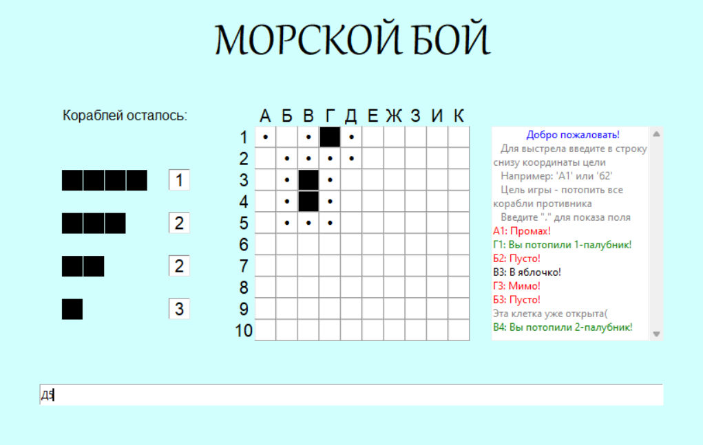

# Сборник работ по дисциплине "Практикум по программированию"
Данные работы выполнялись во время обучения на 1 курсе университета

1. Морской бой - приложение для односторонней игры в морской бой с графическим интерфейсом, созданным при помощи Tkinter
   
   

2. Текстовый калькулятор - программа, принимающая на ввод из консоли математическое выражение в текстовом виде и возвращающая результат тоже текстом

   

3. Модуль для работы с таблицами, хранимыми в файлах csv, pickle, txt

   

4. Игра "Шахматы", выполненная с использованием ООП и графическим интерфейсом на PyGame

   
   
5. Задача коммивояжера. Реализация решения при помощи полного перебора и одного из жадных алгоритмов - метода ближайшего соседа с визуализацией при помощи Networkx
   
   

6. Работа с плоскими фигурами - отработка визуализации фигур при помощи matplotlib (я потерял большинство файлов для этого задания, есть только тестовый пример)
   
   

